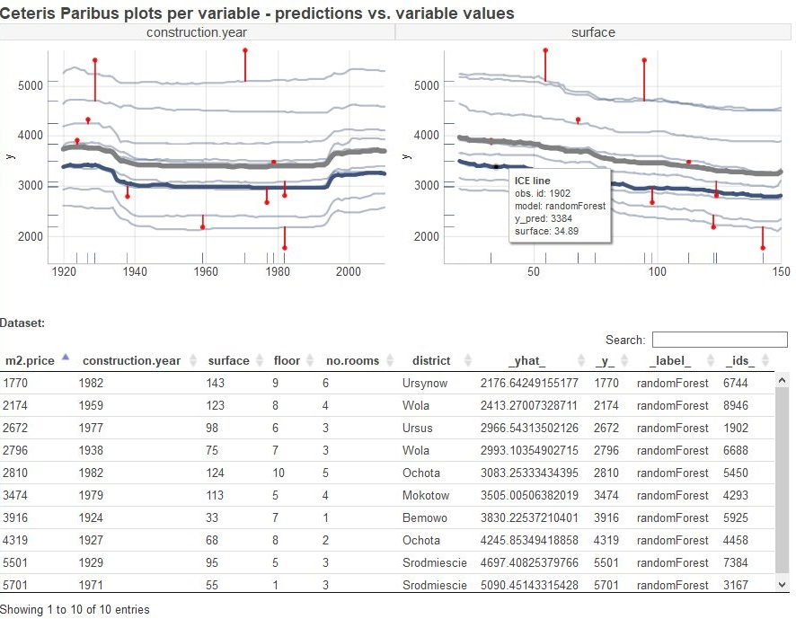
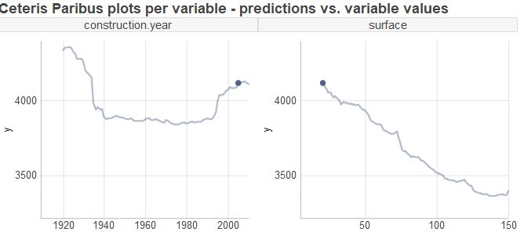
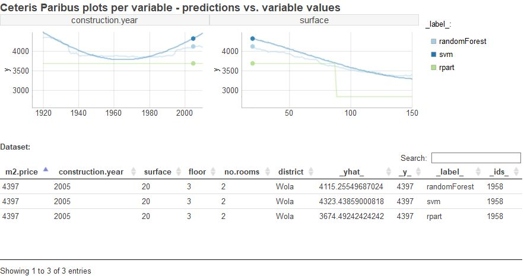
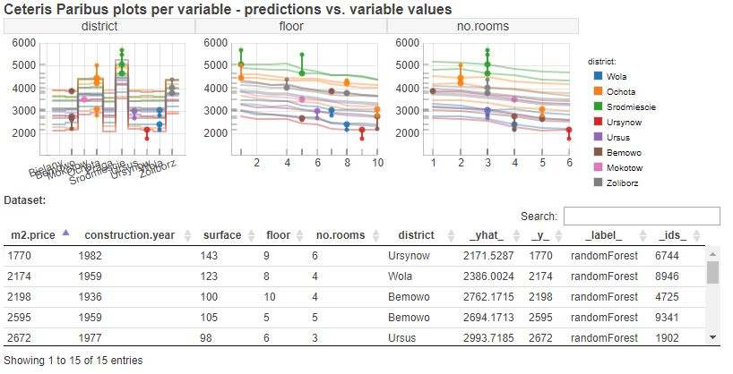

# ceterisParibusD3

## Intro

Machine learning has been recently one of the hottest topics in business and science. In different settings, starting from the intuitive financial ones, through medical usages and ending in high-tech ones as speech recognition, people try to predict outcomes using different statistical models. Previously used algorithms such as linear regression, however simple and interpretable, now often give way to new, more effective models that unfortunately due to their complexity lack interpretability. To maintain both accuracy and interpretability of the model we can use model explanation techniques (so-called eXplainable Artificial Intelligence, XAI) that aim to explain such black-box models through various approaches. One of the most fundamental questions that can be posed regarding model explanation is how model response depends on features from a dataset, which can be answered using *Ceteris Paribus Profiles*. Such profiles show for given observation how model response would change with the change of its value for given variable, while keeping all other variables fixed (hence the name *Ceteris Paribus* - Latin phrase for *all else unchanged*).

## ceterisParibusD3 package

`ceterisParibusD3` package is an interactive (D3 based) extension of plots from [ceterisParibus]( https://github.com/pbiecek/ceterisParibus) R package. It allows user to plot standard charts from the parent package for *Ceteris Paribus profiles* , i.e. each chart can include:

- **ICE** curves for single observation / group of observation / whole dataset
- **PDP** curves that aggregate chosen ICE curves
- **observation points**  and **rugs** corresponding to chosen ICE curves
- **residuals** corresponding to chosen ICE curves

Each chart can be also divided into subplots (panels) per variable from dataset and be coloured by variable (to see interactions between variables) or model type (to compare model behaviours).

`ceterisParibusD3` package adds to these plots:

- **tooltips** (shows info about given element (line, point) after hovering over it, hovering over an element causes also highlighting it on given panel (increasing its stroke, opacity or size) and highlighting elements related to the same data point in other panels)

- **interactive table** (user can hover over each row, which causes highlighting elements related to this observation and hiding unrelated elements (apart from rugs and pdps), also filtering and sorting rows is available)

<center></center>

There is available an implementation of this package in [R](https://github.com/flaminka/ceterisParibusD3) and in [Python](https://github.com/ModelOriented/pyCeterisParibus).
## Examples

ICE curves for single observation:

<center></center>

ICE curves for single observation - model comparison:

<center></center>

## More examples

To see more examples check [this file](https://rawcdn.githack.com/MI2DataLab/ceterisParibusExt/05a06de0de24a3e4f9b6fd98be34fc2a68b0ee3e/ceterisParibusD3/example.html) and play with commented examples in [code](https://github.com/MI2DataLab/ceterisParibusExt/blob/master/ceterisParibusD3/example.html).

## How to use / installation

You can load package directly from github along with its dependencies (see section *Dependencies*) - place this in the head of your HTML code:

```javascript

// html header
<script src="https://d3js.org/d3.v5.min.js" charset="utf-8"></script>
<script src="https://code.jquery.com/jquery-3.3.1.min.js" integrity="sha256-FgpCb/KJQlLNfOu91ta32o/NMZxltwRo8QtmkMRdAu8=" crossorigin="anonymous"></script>
<link rel="stylesheet" type="text/css" href="https://cdn.datatables.net/1.10.19/css/jquery.dataTables.css">
 <script type="text/javascript" charset="utf8" src="https://cdn.datatables.net/1.10.19/js/jquery.dataTables.js"></script>
 <script type="text/javascript" charset="utf8" src="https://rawgit.com/DataTables/Plugins/master/features/pageResize/dataTables.pageResize.js"></script>
<script src="https://rawgit.com/MI2DataLab/ceterisParibusExt/master/ceterisParibusD3/ceterisParibusD3.js" charset="utf-8" lang="js"></script>

// example of usage in js script
<script>

var plot = new ceterisParibusD3.createPlot(div, data, dataObs, options);

</script>
```

### Dependencies

`ceterisParibusD3.js` depends on [d3.js](https://d3js.org/), [jQuery.js](https://jquery.com/), [DataTables.js](https://datatables.net/) and its plugin [pageResize.js](https://github.com/DataTables/Plugins/tree/master/features/pageResize). In section *How to use /installation* you can find example how to include them on your page. 

## Documentation

Package has one main function `createPlot` that is evoked on global package object `ceterisParibusD3`:

```javascript
var plot = new ceterisParibusD3.createPlot(div, data, dataObs, options);
```
where

Parameter | Type | Required| Description
------------ |  -------------| -------------| -------------
`div` |  string or div element with id | yes | id of div container for a plot or div container itself (selected by call of e.g. `document.getElementById("myDiv")`)
`data` |  array of objects | yes | data with *Ceteris Paribus Profiles* curves coordinates, see details in section *Data paremeters* below
`dataObs` |  array of objects | yes | data with observations used to generate *Ceteris Paribus Profiles* , see details in section *Data paremeters* below
`options` |  object | yes | options of the chart, see details in section *Options* below

#### Data parameters

`data` contains information about every point of *Ceteris Paribus Profiles* generated for observations from `dataObs`. Examples of these objects are included in [examples](https://github.com/MI2DataLab/ceterisParibusExt/tree/master/ceterisParibusD3/examples), files such as *example1.js* include examples of `data` and files such as *example_obs1.js* corresponding `dataObs` arrays. There you can also find [R script](https://github.com/MI2DataLab/ceterisParibusExt/blob/master/ceterisParibusD3/examples/Ceteris%20Paribus%20Plots%20page%20-%20examples.R) to generate such files using `ceterisParibus` R package.

We describe general form of array `dataObs` on the *example_obs1.js* shown below. Each object in `dataObs` corresponds to one observation for which given model predicted target value. In case of *example_obs1.js* our dataset has only observation no. *1958* and we predict its target value using one model (*randomForest*), so `dataObs` has just 1 object in it. Characteristic keys are: `_yhat_` (keeps model prediction for given observation),  `_y_` (real target value for given prediction), `_label_` (label of model used for prediction), `_ids_` (id of observation). Combination of `_label_` and `_ids_` make given observation unique in array `data`. Rest of keys (i.e. `m2.price`, `construction.year`, `surface`, `floor`, `no.rooms`, `district`) are variable from given dataset - each variable has its own key-value entry.

```javascript
[
  {
    "m2.price": 4397,
    "construction.year": 2005,
    "surface": 20,
    "floor": 3,
    "no.rooms": 2,
    "district": "Wola",
    "_yhat_": 4094.3828,
    "_y_": 4397,
    "_label_": "randomForest",
    "_ids_": "1958"
  }
]
```

General form of array `data` is described on the example of corresponding *example1.js* file, which extract is shown below. Each object in it corresponds to one point of *Ceteris Paribus Proflie* calculated for observation `_ids_`, model `_label_` and variable `_vname_`. It includes analogical keys corresponding to dataset variables as array `dataObs` (here: `m2.price`, `construction.year`, `surface`, `floor`, `no.rooms`, `district`), and model prediction for these point in `_yhat_`. Below we can see two points of the profile calculated for observation *1958* for model *randomForest* for variable *construction.year*: one point with construction.year = 1920 and one with construction.year =1921 (while as you can see above in `dataObs` the real value of construction.year for this observation is 2005).

```javascript
[
  {
    "m2.price": 4397,
    "construction.year": 1920,
    "surface": 20,
    "floor": 3,
    "no.rooms": 2,
    "district": "Wola",
    "_yhat_": 4264.6774,
    "_vname_": "construction.year",
    "_ids_": "1958",
    "_label_": "randomForest"
  },
  {
    "m2.price": 4397,
    "construction.year": 1921,
    "surface": 20,
    "floor": 3,
    "no.rooms": 2,
    "district": "Wola",
    "_yhat_": 4291.5103,
    "_vname_": "construction.year",
    "_ids_": "1958",
    "_label_": "randomForest"
  },
  ...
 ]
```


#### Options

Options that can be set by `options` parameter:

Option | Type | Default | Required| Description
------------ |  -------------| -------------| -------------| -------------
`variables` |  array of strings|  all variables from dataset | no | names of variables to be plotted; should be compatible with variables from `data` and `dataObs`
`show_profiles` | boolean | true |  no | If true,  ICE lines are plotted
`show_observations` | boolean | true |  no | If true,  observation points are plotted
`show_rugs` | boolean | true |  no | If true,  rugs are plotted
`show_residuals` | boolean | true|  no| If true,  residuals  are plotted
`aggregate_profiles` | string | null |  no | If 'mean', PDPs are plotted (calculated as mean of ICE's), if 'median' PDPs are plotted (calculated as median of ICE's)
`width` | number | 600 | no | width of the plot, in px
`height` | number | 400 | no | height of the plot, in px
`auto_resize` | boolean | true| no | If true, plot will be resized when its container will be resized (it includes resize of subplots, legend and fonts)
`color` |  string |  '#3F547F' | no |  name of variable that should be used for coloring elements of the chart (use `_label_` to color by model type) or color name/hex code; if categorical variable is set to be a color variable, it should have max. 10 categories
`no_colors` |  number |  3 | no |  number of colors to be used for sequential palette when `color` is set as quantitative variable,  from 1 to 9
`add_table` |  boolean |  true | no | If true, table with observations from `dataObs` will be plotted below plots (taking half of the whole chart height)
`categorical_order` |  array of objects |  null | no | definition of order of categories for categorical variables, each object in the array corresponds to one categorical variable and has key `variable` which value is string with name of variable and keys called `rank1`, `rank2` etc.  (number of these keys corresponds to number of categories of this variable) which values are strings with categories, see example in section *Usage*
`size_rugs` |  number |  1 | no |  size of rugs, from 0 to 1
`size_points` |  number |  3 | no |  size of points, in px
`size_residuals` |  number |  2 | no |  size of residuals lines and points, in px
`size_pdps` |  number |  3.5 | no |  size of residuals lines and points, in px
`size_ices` |  number |  2 | no |  size of residuals lines and points, in px
`alpha_rugs` |  number |  0.9 | no |  transparency of rugs, from 0 to 1
`alpha_points` | number | 0.9   |  no |   transparency of points, from 0 to 1
`alpha_residuals` |  number |  0.9 | no |  transparency of residuals points and lines, from 0 to 1
`alpha_pdps` |  number |  0.4 | no |  transparency of PDP ines, from 0 to 1
`alpha_ices` |  number |  0.4 | no |  transparency of ICE lines, from 0 to 1
`color_rugs` |  string  |  '#3F547F'  |  no |   rugs color name/hex code, if not given color is taken from `color` option
`color_points` | string    | '#3F547F'   |  no |   points color name/hex code, if not given color is taken from `color` option
`color_residuals` | string   |  '#3F547F'  | no  |   residuals points and lines color name/hex code, if not given color is taken from `color` option 
`color_pdps` |  string  | 'grey'   | no  | PDP lines color name/hex code 
`font_size_plot_title` |  number  | 16   | no  | font size of plot title, in px
`font_size_titles` |  number  | 14  | no  | font size of subplots' title, in px
`font_size_legend` |  number  | 12 | no  | font size of legend elements, in px
`font_size_axes` |  number  | 12 | no  | font size of axes elements, in px
`font_size_tootlips` |  number  | 10 | no  | font size of tooltip text, in px
`font_size_table` |  number  | 12 | no  | font size of table's text, in px
`plot_title` |  string  | 'Ceteris Paribus plots per variable - predictions vs. variable values' | no  | title of plot
`yaxis_title` |  string  | 'y' | no  | title of y axes


#### Usage

Example of code usage on exemplary data [`example12`](https://github.com/MI2DataLab/ceterisParibusExt/blob/master/ceterisParibusD3/examples/example12.js) and [`example_obs12`](https://github.com/MI2DataLab/ceterisParibusExt/blob/master/ceterisParibusD3/examples/example_obs12.js):

```javascript
var plot = new ceterisParibusD3.createPlot(div = "chartDiv", 
                       data = example12,
                       dataObs = example_obs12, 
                       options = {
                                   variables: ["district",  "floor", 'no.rooms'],
                                   color: 'district',
                                   show_profiles: true, 
                                   show_observations: true, 
                                   show_rugs: true, 
                                   show_residuals: true, 
                                   aggregate_profiles: 'mean',
                                   add_table: true,
                                   no_colors: 3,
                                   height: 400,
                                   width: 800,
                                   size_rugs: 0.5,
                                   yaxis_title: '',
                                   color_rugs: 'grey',
                                   categorical_order: [
                                   { 'variable': 'district', 
                                     'rank1': "Bielany", 
                                     'rank2': "Bemowo", 
                                     'rank3': "Mokotow", 
                                     'rank4': "Ochota", 
                                     'rank5': "Praga", 
                                     'rank6': "Srodmiescie", 
                                     'rank7': "Ursus", 
                                     'rank8': "Ursynow", 
                                     'rank9': "Wola", 
                                     'rank10': "Zoliborz"
                                  }]  
                                }
                       );
```
and its output: 

<center></center>


## Issues and suggestions

To report a bug or propose a new feature please review these guidelines:

* make sure you have the latest version of the package
* check whether it is not already in [Issues](https://github.com/MI2DataLab/ceterisParibusExt/issues)
* add an issue following suitable template: for [bugs](https://github.com/MI2DataLab/ceterisParibusExt/blob/master/ceterisParibusD3/bug_template.md) or for [suggestions](https://github.com/MI2DataLab/ceterisParibusExt/blob/master/ceterisParibusD3/suggestion_template.md)

## Acknowledgments

Work on this package is financially supported by the NCN Opus grant 2017/27/B/ST6/01307.
